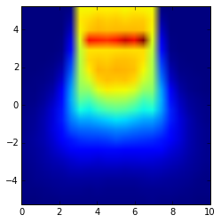

Use https://github.com/christopherpoole/3DDose to load .3ddose file produced by dosxyznrc. File produced by example air_bone_interface_example.

    import numpy as np
    import py3ddose as py3ddose
    import matplotlib.pyplot as plt
    %matplotlib inline

    data = py3ddose.DoseFile('RC_air_bone_interface_example.3ddose') # prints data shape

    (20, 21, 21)

    plt.imshow(data.dose[:,:,10])  # basic plot

    <matplotlib.image.AxesImage at 0x105c1d610>

Get axis 

    x_min = data.positions[0][0]
    x_max = data.positions[0][-1]
    y_min = data.positions[1][0]
    y_max = data.positions[1][-1]
    plot_extent=[x_min, x_max, y_min, y_max]
    plot_extent

    [0.0, 10.0, -5.25, 5.25]

Save plane as a text file for visualisation eg using imageJ using file > import text

    z_slice = 10
    plt.imshow(data.dose[:,:,z_slice], extent = plot_extent)  

    <matplotlib.image.AxesImage at 0x106f1c850>

    np.savetxt('data_plane.txt', data.dose[:,:,10])  

    plt.plot(data.dose[10,:,10])  # 1d plot of profile

    [<matplotlib.lines.Line2D at 0x10605e4d0>]

    
